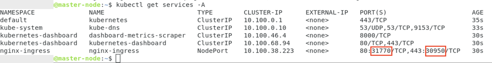
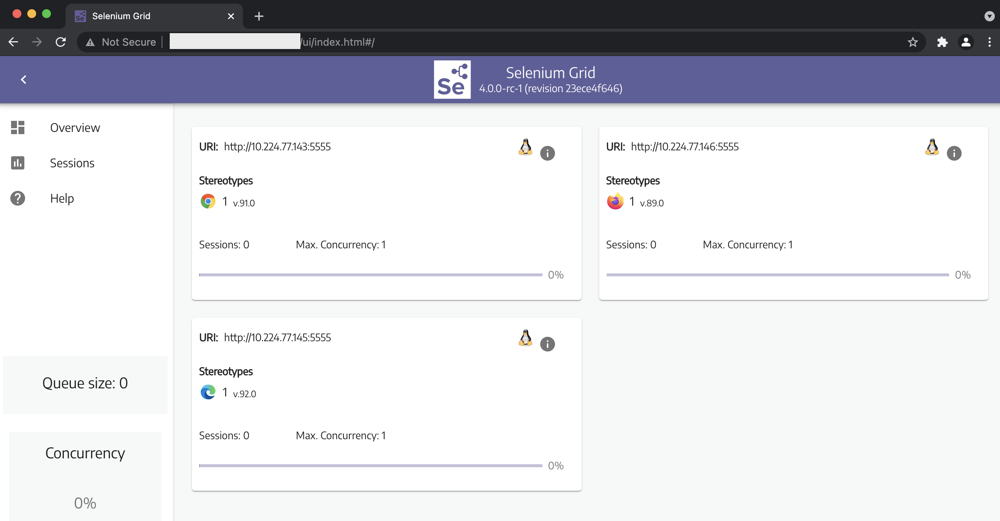

<h1 align="center">Kubernetes on Unbuntu</h1>
<p align="center">This project give you a collection of tools to create/delete Kubernetes Cluster on Ubuntu.</p>

# 1. Prerequisites
Make sure you have installed/config these tools before going to futher steps:
* Docker and Containerd: https://docs.docker.com/engine/install/ubuntu/
* Config container runtimes: https://kubernetes.io/docs/setup/production-environment/container-runtimes/
* Installed kubeadm, kubelet and kubectl: https://kubernetes.io/docs/setup/production-environment/tools/kubeadm/install-kubeadm/
* Open ports: 
    * Run this command on the Control Plane:
        ```
        ./control-plane-open-ports.sh
        ```
    * Run this command on the worker node:
        ```
        ./node-open-ports.sh
        ```
# 2. Clean the old cluster
Run the command [`./delete-cluster.sh`](./delete-cluster.sh)

# 3. Create new cluster
## 3.1. Init cluster
* Open the file [`./kubeadm/kubeadm-config.yaml`](./kubeadm/kubeadm-config.yaml), 
    * Change the values of `advertiseAddress` and `controlPlaneEndpoint` according to your environemt. 
    * Add your control plan node's address to certSANs too.
* If you would like to use Cert Manager, make sure to change the email in [nginx-ingress/cert-manager/cert-manager-issuers.yaml](./nginx-ingress/cert-manager/cert-manager-issuers.yaml) too.
* Change `username` and `usergroup` in the command [`./create-cluster.sh`](./create-cluster.sh), and run it.
## 3.2. Join worker node

```
kubeadm join --cri-socket /run/containerd/containerd.sock --token <token> <control-plane-host>:<control-plane-port> --discovery-token-ca-cert-hash sha256:<hash>
```

# 4. Deploy new services
## 4.1. Deploy service
* Create new deployment file (`.yaml` file)
* Apply the deployment file (call the command `kubectl apply -f <deployment file>` or use Dashboard to deploy)
* Expose your service:
    * Create a `.yaml` file for your Ingress resouce to expose your service. Look at the Ingress in [`./dashboard/kubernetes-dashboard.yaml`](./dashboard/kubernetes-dashboard.yaml) for an example.
    * Deploy it via `kubectl apply -f` or Dashboard
## 4.2. Mapping domain
* Assume you own the domain example.org, and already point all the subdomain `*.example.org` to our you office. Also, assume you have an Nginx proxy server. If you want to point one of the sub domain to your service, let follow these steps:
    * Double check which ports are being used by the Nginx Ingress service on your cluser:
    
    * SSH to the proxy server:
        * Create a new config file in `/etc/nginx/sites-availble`, forward the request ro your Nginx Ingress Controler on your master node (You can put the [example file](./example/dashboard/dashboard.k8s-cluster.example.org.conf) in /etc/nginx/sites-availble/dashboard.k8s-cluster.example.org.conf, then change the domain name, ports, and ssl config).
        * Link the new config file to `/etc/nginx/sites-enable`
        * Make sure you have included this line in the section `http` of `/etc/nginx/nginx.conf`
            ```
            include /etc/nginx/sites-enabled/*;
            ```
        * Test the new config:
            ```
            sudo nginx -t
            ```
        * If everything are OK, reload the nginx:
            ```
            sudo nginx -s reload
            ```
# 5. Example
We will demonstrate how to deploy services on Kubernetes by Deploy Selenium Grid for Automation Test.
> **Note:** We split the `.yaml` files to explain step by step, you can merge all the yaml file in this example in to one, and deploy them once. We use command line to deploy the services, but you can also use the Dashboard instead of.
## 5. 1. Deploy the services
```
kubectl apply -f ./example/selenium/full-grid.yaml
```
## 5.2. Auto scalling (optional)
```
kubectl apply -f ./example/selenium/nodes-autoscale.yaml
```
## 5.2. Expose the service
```
kubectl apply -f ./example/selenium/ingress.yaml
```
## 5.4 Mapping domain
* SSH to the proxy server (192.168.3.37)
* Create the config file at /etc/nginx/sites-available/[`selenium.example.org.conf`](./example/selenium/selenium.example.org.conf). Make sure to update the host, port, and proxy_pass according to your Kubernetes and Ingress Controller.
* Then link it to /etc/nginx/sites-enable/
```
cd /etc/nginx/sites-enable/
sudo ln -s ../sites-available/selenium.example.org.conf
```
* Check if there are any errors
```
sudo nginx -t
```
* Reload the proxy
```
sudo nginx -s reload
```
## 5.5. Double check
If everything work well, access http://selenium.example.org, you should see something look like this:


# 6. Remain issues
We already install [`Cert-Manager`](https://cert-manager.io/docs/) to generate certificates automatically (using [`Letsencrypt`](https://letsencrypt.org/)).

But there is an issue with forwarding `https` request to the our Kubernetes, it make the proxy server and the order hang out. We need someone continue the work, follow these guideline to troubleshoote:
* [Securing HTTP Traffic to Upstream Servers](https://docs.nginx.com/nginx/admin-guide/security-controls/securing-http-traffic-upstream/)
* [Cer-Manager Troubleshooting](https://cert-manager.io/docs/faq/troubleshooting/)
# Reference
* [Installing a Pod network add-on](https://kubernetes.io/docs/setup/production-environment/tools/kubeadm/create-cluster-kubeadm/#pod-network)
* [Calico](https://docs.projectcalico.org/getting-started/kubernetes/quickstart)
* [Calico Node, more like Calico No](https://portal2portal.blogspot.com/2021/05/calico-node-more-like-calico-no.html)
* [Kubernetes Ingress](https://kubernetes.io/docs/concepts/services-networking/ingress/)
* [Ingress Operator](https://github.com/nginxinc/nginx-ingress-operator/blob/master/docs/installation.md)
* [Nginx Ingress Controller](https://github.com/nginxinc/nginx-ingress-operator/blob/master/docs/nginx-ingress-controller.md)
* [Nginx Ingress Controller Installation with Manifests](https://docs.nginx.com/nginx-ingress-controller/installation/installation-with-manifests/)
* [Ingress Resouce](https://docs.nginx.com/nginx-ingress-controller/configuration/ingress-resources/)
* [Cer-manager](https://cert-manager.io/docs/installation/kubectl/)
* [Issuer](https://cert-manager.io/docs/concepts/issuer/)
* [Certificate](https://cert-manager.io/docs/concepts/certificate/)
* [Easier Troubleshooting of cert-manager Certificates](https://www.jetstack.io/blog/cert-manager-status-cert/)
* [Issuer Configuration](https://cert-manager.io/docs/configuration/)
* [Troubleshooting Issuing ACME Certificates](https://cert-manager.io/docs/faq/acme/)
* [Exposing Kubernetes dashboard](https://jonathangazeley.com/2020/09/16/exposing-the-kubernetes-dashboard-with-an-ingress/)
* [Disable Authentication and HTTPS in Kubernetes Dashboard](https://vividcode.io/disable-authentication-and-https-in-kubernetes-dashboard/)
* [Metrics server](https://github.com/kubernetes-sigs/metrics-server)
* [Using RBAC Authorization](https://kubernetes.io/docs/reference/access-authn-authz/rbac/)